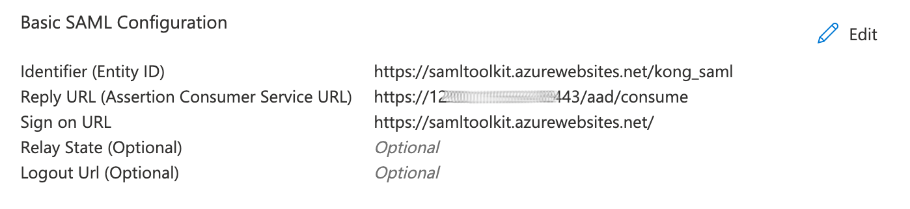
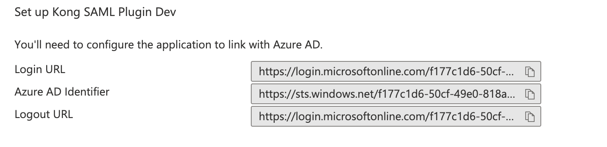

## Kong Configuration

### Create an Anonymous Consumer:

```bash
http -f put :8001/consumers/anonymous
```
```http
HTTP/1.1 200 OK
```
```json
{
    "created_at": 1667352450,
    "custom_id": null,
    "id": "bec9d588-073d-4491-b210-1d07099bfcde",
    "tags": null,
    "type": 0,
    "username": "anonymous",
    "username_lower": null
}
```

### Create a Service

```bash
http -f put :8001/services/saml-service url=https://httpbin.org/anything
```
```http
HTTP/1.1 200 OK
```
```json
{
    "id": "5fa9e468-0007-4d7e-9aeb-49ca9edd6ccd",
    "name": "saml-service",
    "protocol": "https",
    "host": "httpbin.org",
    "port": 443,
    "path": "/anything"
}
```

### Create a Route

```bash
http -f put :8001/services/saml-service/routes/saml-route paths=/saml
```
```http
HTTP/1.1 200 OK
```
```json
{
    "id": "ac1e86bd-4bce-4544-9b30-746667aaa74a",
    "name": "saml-route",
    "paths": [ "/saml" ]
}
```

### Setup Microsoft AzureAD 

1. Create a SAML Enterprise Application. Refer to [Microsoft AzureAD documentation](https://learn.microsoft.com/en-us/azure/active-directory/manage-apps/add-application-portal) for further information.
2. Note the `Identifier (Entity ID)` and `Sign on URL` parameters
3. Configure the `Reply URL (Assertion Consumer Service URL)`, for example, "https://kong-proxy:8443/saml/consume"
4. Assign users to the SAML Enterprise Application

### Create a Plugin on a Service

Validation of the SAML response Assertion is disabled in the plugin
configuration below. This configuration should not be used in a
production environment.

Replace the `Azure_Identity_ID` value below, with the value of
`Identity (Entity ID)` from the Single sign-on - Basic SAML
Configuration from the Manage section of the Microsoft AzureAD
Enterprise Application:



Replace the `AzureAD_Sign_on_URL` value below, with the value of
`Login URL` from the Signke sign-on - Set up Service Provider section
from the Manage section of the Microsoft AzureAD Enterprise
Application:



```bash
http -f post :8001/services/saml-service/plugins                                                  \
  name=saml                                                                                       \
  config.anonymous=anonymous                                                                      \
  service.name=saml-service                                                                       \
  config.issuer=AzureAD_Identity_ID                                                               \
  config.idp_sso_url=AzureAD_Sign_on_URL                                                          \
  config.assertion_consumer_path=/consume                                                         \
  config.validate_assertion_signature=false
```
```http
HTTP/1.1 200 OK
```
```json
{
    "id": "a8655ba0-de99-48fc-b52f-d7ed030a755c",
    "name": "saml",
    "service": {
        "id": "5fa9e468-0007-4d7e-9aeb-49ca9edd6ccd"
    },
    "config": {
        "assertion_consumer_path": "/consume",
        "validate_assertion_signature: false,
        "idp_sso_url": "https://login.microsoftonline.com/f177c1d6-50cf-49e0-818a-a0585cbafd8d/saml2",
        "issuer": "https://samltoolkit.azurewebsites.net/kong_saml"
    }
}
```

### Test the SAML plugin

1. Using a browser, go to the URL (https://kong:8443/saml)
2. The browser is redirected to the AzureAD Sign in page. Enter the user credentials of a user configured in AzureAD
3. If user credentials are valid, the brower will be redirected to https://httpbin.org/anything
4. If the user credentials are invalid, a 401 Unauthorized HTTP Status code is returned


